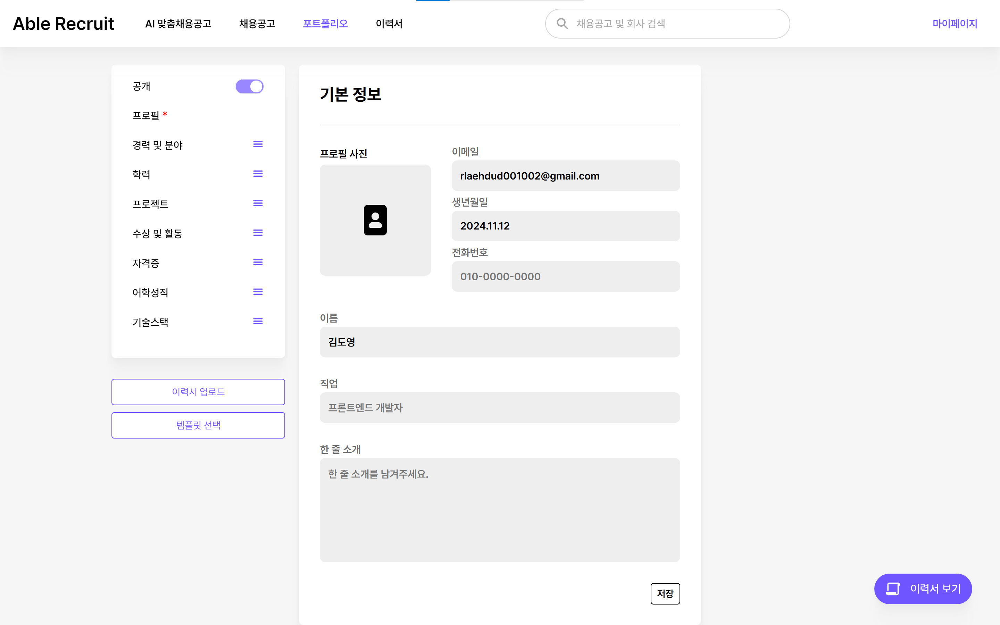

# [Able Recruit 👔](https://www.noteme.kro.kr)

## Index

#### &emsp; [➤ 프로젝트 소개](#-프로젝트-소개) 

#### &emsp; [➤ 프로젝트 설계](#-프로젝트-설계) 

#### &emsp; [➤ 기능 소개](#-기능-소개) 

#### &emsp; [➤ 산출물](#-산출물) 

 

# 📄프로젝트 소개

## 기획 배경

실제 외부 조사기관 자료에 의하면, 취업 준비에 어려움을 겪고 있는 취업 준비생이 약 82%에 달하는 것으로 나타났습니다.
  
대부분 채용 공고 탐색과 자신을 어필하는 과정에서 크게 어려움을 겪고 있음을 알 수 있었습니다.
  
AI를 활용한 채용 공고 추천과, 이력서 및 포트폴리오 관리를 도와줌으로써 이러한 문제를 해결하고자 프로젝트를 진행하게 되었습니다.

## 프로젝트 소개

### 🎯 AI 기반 종합 채용 시스템

1. 맞춤 채용 공고 추천

2. 포트폴리오 관리

3. GitHub 프로젝트 분석

4. 면접 예상 질문 메일링

 

## 📆 프로젝트 기간

<table border="1" cellpadding="10">
    <tr>
        <th>프로젝트 기간</th>
        <td>2024.10.14 ~ 2024.11.19 (5주)</td>
    </tr>
</table>

 

## 팀 소개

<table border="1" cellpadding="15">
    <tr>
        <th>Contributors</th>
        <td>Position</td>
    </tr>
    <tr>
        <th>김범수</th>
        <td>- 팀장   - BackEnd   - AI   - GitHub 분석   - 이력서 API</td>
    </tr>
    <tr>
        <th>김용수</th>
        <td> - BackEnd   - 메일링 서비스   - 외부 이력서 인식 AI</td>
    </tr>
    <tr>
        <th>민준수</th>
        <td>- BackEnd   - INFRA   - 기업 및 채용공고 API</td>
    </tr>
    <tr>
        <th>김보현</th>
        <td>- FrontEnd   - 회원가입 / 로그인   - 포트폴리오 작성 페이지</td>
    </tr>
    <tr>
        <th>김도영</th>
        <td>- FrontEnd   - ISR 적용   - 공고 / 회사 상세 페이지   - 포트폴리오 페이지</td>
    </tr>
    <tr>
        <th>윤하연</th>
        <td>- FrontEnd   - 이력서 업로드 및 공고 추천   - GitHub 분석   - CSS 스타일링</td>
    </tr>
</table>

   

# 📄프로젝트 설계

## 개발 환경

BE : SpringBoot, JPA, QueryDSL, Spring AI, Spring Security, RestDocs, Mockito, thymeleaf
 
FE : NextJS 14.2.15, React 18, TypeScript, mongoose
 
INFRA : PostgreSQL, Redis, GCS, MinIO, MongoDB, GitHub Actions
 
AI : GhatGPT API, Llama, FastAPI, celery

 

### BackEnd

  

    
    
    
    
  

  
### FrontEnd

  

    
    
    
    
    
  

### AI

  

    
    
    
  

### INFRA

  

     
     
     
    
    
    
  

  
### DB

  

     
    
    
  

### 협업 툴

  

     
     
    
    
  

   

# 📄기능 소개

### 1. 맞춤 채용 공고 추천

1.1 이력서 등록

&emsp;- Drag And Drop을 이용해 손쉽게 이력서를 λ“±λ΅ν•  수 있습니다.

  
  
  
  

 

1.2 이력서 분석

&emsp;- λ“±λ΅ν• 이력서를 AI 서버로 보내 맞춤 채용 공고를 추천해줍니다.

  
  
  
  

 

1.3 채용 상세 정보 및 회사 상세 정보 확인 가능

  
  

 

### 2. 포트폴리오 관리

2.1 포트폴리오 작성

&emsp;- 포트폴리오를 직접 작성할 수 있습니다

&emsp;- 이러한 과정이 복잡하다면, 이미 보유한 이력서를 불러와 자동완성으로 포트폴리오를 채워줍니다.

&emsp;- 불러온 이력서 데이터와 현재 등록되어있는 데이터를 비교하여 원하는 정보를 선택하여 넣을 수 있습니다.

  
  
  
  
  

2.2 포트폴리오 순서 및 템플릿 변경

&emsp;- 프로필을 제외한 모든 요소의 순서를 원하는대로 변경할 수 있습니다.

&emsp;- 완성된 포트폴리오는 4가지의 템플릿 중에서 선택할 수 있습니다.

&emsp;- 포트폴리오의 공개 여부 또한 설정할 수 있어, 공개하고 싶지 않은 경우 비공개 설정이 가능합니다.

  
  
  

 

### 3. GitHub 프로젝트 분석

3.1 깃허브 연동

&emsp;- 이메일 인증 후, 깃허브와 연동하여 public으로 공개된 repository를 가져올 수 있습니다.

  

3.2 repository 및 branch 선택

&emsp;- 분석할 repository와 branch를 선택하여 분석 요청을 할 수 있습니다.

  

3.3 프로젝트 분석 완료

&emsp;- 분석이 완료되면 등록된 이메일로 프로젝트 분석 결과가 전송됩니다.

&emsp;- 전송된 이메일에서는 프로젝트 요약, 사용 기술, 핵심 기능 및 프로젝트 강점을 확인할 수 있습니다.

  
  
  

 

### 4. 면접 예상 질문 메일링

4.1 면접 질문 메일링 서비스

&emsp;- 등록된 이력서를 기반으로 CS 질문을 생성하여 매일 아침에 등록된 이메일로 CS 질문이 전송됩니다.

  
  

   

# 📄산출물

##### [⚙ Architecture](./readMeImage/PROJECT/Swagger.png)

##### [⚙ ERD](./readMeImage/PROJECT/ERD.png)

##### [📋 API 명세서](./readMeImage/PROJECT/Swagger.png)

   

### [커밋 컨벤션 🎯](https://www.notion.so/11ff07ca98df81199ddbffe1d083674d)

- `[FEAT]` : 새로운 기능 추가

- `[FIX]` : 버그 수정

- `[DOCS]` : 문서 수정

- `[STYLE]` : 코드 포맷팅, 세미콜론 누락, 코드 변경이 없는 경우

- `[REFACTOR]`: 코드 리펙토링

- `[TEST]` : 테스트 코드, 리펙토링 테스트 코드 추가

- `[CHORE]` : 빌드 업무 수정, 패키지 매니저 수정

- `[DESIGN]` : CSS 등 사용자 UI 디자인 변경

- `[!HOTFIX]` : 급하게 치명적인 버그를 고쳐야 하는 경우

- `[MERGED]` : 만약 Merge 할 때 Conflict가 발생할 경우, 사용할 커밋 유형
